# Globurst-Sales-Analysis
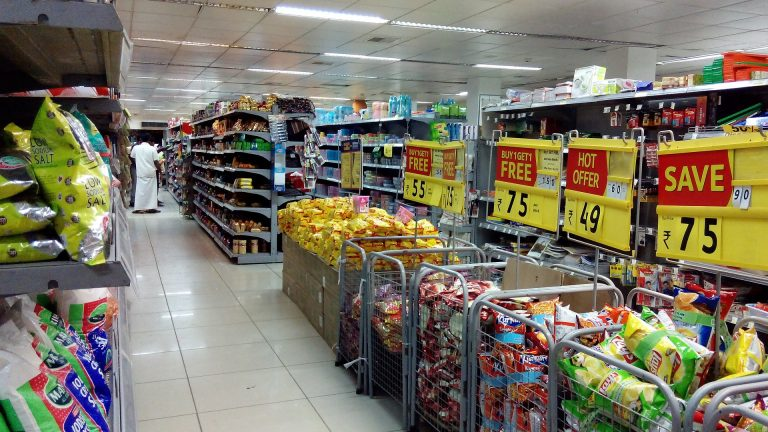
## Overview

Globurst is a superstore in Lagos Nigeria, a single branch supermarket. Unlike other chain stores, Globurst embrace data driven approach for its growth and market domiance based on the recent trends.

This data covered a period of two years, 2021 to 2022. During this period, the we examined the growth in term of revenue generated and sales made in the period in consideration. 

## Problem Statements
The following are the problem statements:
- The top 15 revenue generating products
- The monthly sales trend during the period
- The top sales based on categories.
- The sales from the diffrent sales channels
- The sales from Payment methods used.
- Profit made on quarterly basis.

## Skills demonstrated
The following skills were demonstrated during this analysis;
- Data cleaning and transformation.
- Data normalization and Data modellng.
- Dax calculation for measures and conditional formating.
- Data Vitalization.
- Analytical, Predictive and critical skills.

## Data source

This is a computer generated data by the POS system, printed out from the system into an excel file named "input data". This data has 528 rows and 16 fields. It is a clean data having zero error and has no null values. 

## Data Transformation

I decided to normalize my data due to its numerous advantages especially for removing reduntant data and duplicated values which will consequently lead to faster queries or loading as the case may be. The input data was renamed to sales data then duplicated and the duplicate was renamed to products. Irrelevant fields in products data was removed, then I removed duplicates from the remaning products data. Thereafter, a date table was created using the calender function. Therefore we have three datasets, sales , products and date data.

## Data Modelling

Relationships were detected automatically among these three tables, using star schema. The sales table being the fact table and date and products being dimension table. One to many relationships were established bwtween the products and the sale data using the product key as the link, also the date table was liked to the sales data using the date field coloumn in date table as the primary key.

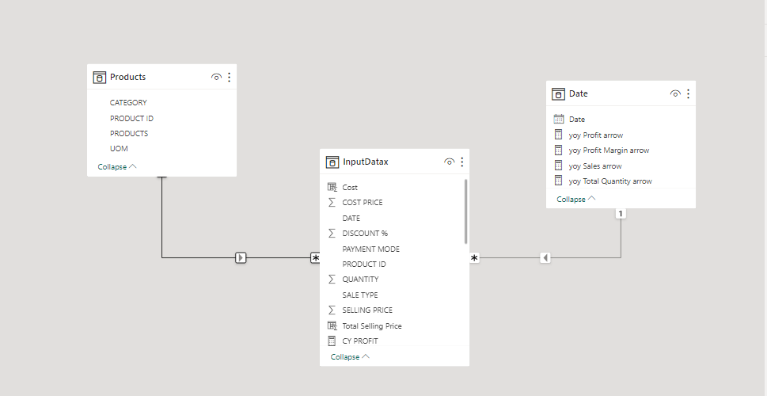

## Analysis And virtualization.
The following are the insights;

### Revenue Generated from sales.
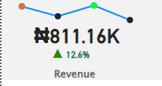

The revenue generated from sales was above # 118000.16k.

###  The Profit.
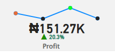

The Profit at the period was # 115000.27k.

### The profit Margin.
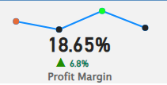

The proft margin was 18.65%.

###  Quantity Sold 
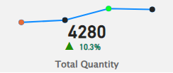

The total quantity sold was 4280 units

### Top 15 revenue generating Products
The top product is Sonny Bravia Full HD 1080 followed by Samsung Smartwatch and Toshiba 43" televison made the top three why the last three revenue generating products are; Mackerel, Halibut and Bat Music 5800. The full top 15 products  are shown below.

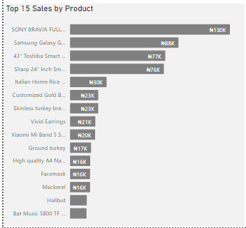

### Top used sales channels
More sales and revenue were made from direct sales which account for about 50.9% of the total sales, followed by online sales which account for 34.4% and lastly sales made by wholesalers account for 14.7% of the total revenue.

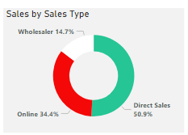

### Top Payment method
Over half of the sales was recieved by cash (# 414000.37k), which is probably due to high  direct sales and a whopping amount of # 393000.79k was made from online sales.

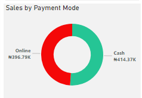

### The Monthly Sales Trend
The sales trend shows the most active sales month. Most sales was made on January, then July and June repectively.

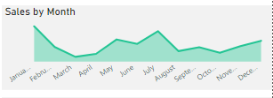

### Top Sales By Category
The highest revenue was made from electronic related appliances, gloceries and Home office.
respectively.

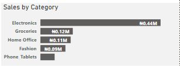

### Sales By Quarters.
Most sales was made in the 3rd quarter, 1st quarter, 4th quarter and 2nd quarter respectively.

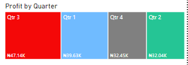

## Conclusions, Recomenations and Predictions.

### Conclusions
The following conclusion is drawn from the analysis:
- Increased in overall sales by 18.65% year-over-year.
- Revenue is up 12.6%, profit is up 20.3%, and profit margin is up 6.8%.
- The top 15 selling products account for 4280 units sold.
- SONY BRAVIA FURI TV, which generated N130K in sales is the top selling products.
- Wholesaler sales make up 14.7% of total sales, followed by direct sales at 50.9% and online sales at 34.4%.
- Electronics, followed by groceries, home office, fashion, and phone tablets represent the highest sales categories in that order.
- Cash is the most popular payment method, followed by online payments.

### Recommendations
- Continue to focus on selling profitable products like the SONY BRAVIA FURI TV.
- More wholesalers should be engaged to boost sales from that channel.
- Direct sales and online sales are growing faster than wholesaler sales, so focus on growing these channels.
- Groceries and home office products are selling well, so continue to focus on these categories.
- Offer more payment options to customers, such as credit cards and mobile payments.

### Predictions
- Sales are likely to continue to grow in the future, driven by the strong performance of the company's products and sales channels.
- The profit margin is also likely to continue to grow, as the company is able to sell more products at higher prices.
- The electronics and groceries categories are likely to remain the top-selling categories.
- Online sales are likely to continue to grow faster than other sales channels.

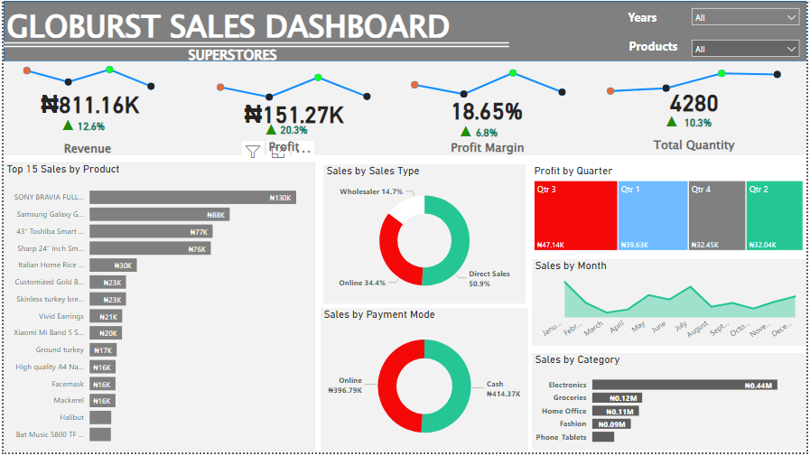

### Thank you.

